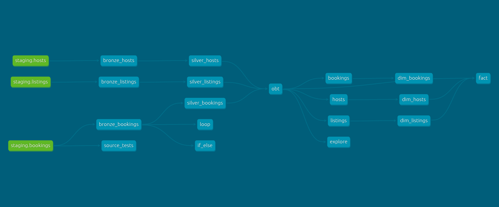

# Airbnb Data Engineering Pet Project

## Overview

Учебный Data Engineering проект, демонстрирующий полный цикл работы с данными Airbnb: от загрузки исходных данных из S3-совместимого хранилища до построения многоуровневой модели данных в dbt.

Проект реализует классический подход к организации аналитического хранилища:

* загрузка данных из Object Storage (S3);
* хранение сырых данных в PostgreSQL;
* трансформация данных через dbt;
* построение слоев Bronze → Silver → Gold;
* использование макросов, инкрементальных моделей и снапшотов.

---

## Architecture

```text
                ┌─────────────────┐
                │   S3 Storage    │
                │  CSV datasets   │
                └────────┬────────┘
                         │
                         ▼
              s3_to_postgres.py
                         │
                         ▼
                ┌─────────────────┐
                │    PostgreSQL   │
                │     staging     │
                └────────┬────────┘
                         │
                         ▼
                     dbt Core
                         │
        ┌────────────────┼────────────────┐
        ▼                ▼                ▼
     Bronze           Silver           Gold
  Raw layer      Cleaned layer     Business layer
```

---

## DBT Lineage Graph



---

## Tech Stack

* Python
* PostgreSQL
* Docker Compose
* AWS S3 / S3-compatible storage
* boto3
* psycopg2
* dbt Core
* dbt-postgres
* dbt-clickhouse
* Jinja2
* SQL

---

## Project Structure

```text
.
├── docker-compose.yml
├── requirements.txt
├── src
│   └── loaders
│       └── s3_to_postgres.py
│
├── infrastructure
│   └── postgres
│
└── s3_dbt_clickhouse_project
    ├── models
    │   ├── bronze
    │   ├── silver
    │   ├── gold
    │   └── sources
    │
    ├── snapshots
    ├── macros
    ├── analyses
    └── tests
```

---

## Data Loading

Источник данных хранится в S3 bucket.

Загрузчик `s3_to_postgres.py`:

1. подключается к S3 через boto3;
2. считывает CSV-файлы:

   * listings
   * bookings
   * hosts
3. загружает данные в PostgreSQL через `COPY FROM STDIN`.

Использование PostgreSQL COPY позволяет существенно ускорить загрузку по сравнению с INSERT.

---

## Data Model

### Staging Layer

Исходные данные загружаются в схему:

```text
staging
├── listings
├── bookings
└── hosts
```

---

### Bronze Layer

Слой сырых данных.

Модели:

```text
bronze_listings
bronze_bookings
bronze_hosts
```

Особенности:

* incremental materialization;
* загрузка только новых записей по `created_at`.

Пример:

```sql
SELECT *
FROM source_table
WHERE created_at > max(created_at)
```

---

### Silver Layer

Слой очистки и стандартизации данных.

#### silver_listings

Преобразования:

* типизация данных;
* использование пользовательского макроса `tag()`;
* расчет дополнительных признаков.

#### silver_bookings

Преобразования:

* расчет итоговой стоимости бронирования через макрос `multiply()`.

#### silver_hosts

Преобразования:

* нормализация имени хоста;
* категоризация качества ответа:

```text
VERY GOOD
GOOD
FAIR
POOR
```

---

### Gold Layer

Бизнес-витрины.

#### OBT (One Big Table)

Объединяет:

```text
bookings
+
listings
+
hosts
```

Включает:

* характеристики жилья;
* информацию о хозяине;
* данные по бронированию.

#### Fact Table

Финальная аналитическая витрина для BI и отчетности.

---

## dbt Features Demonstrated

### Incremental Models

Используются для уменьшения времени пересборки моделей.

```sql
{{ config(materialized='incremental') }}
```

---

### Macros

Проект содержит собственные макросы:

```text
tag.sql
multiply.sql
trimmer.sql
generate_schema_name.sql
```

Пример:

```sql
{{ multiply('nights_booked', 'booking_amount', 2) }}
```

---

### Snapshots

Используются для отслеживания изменений измерений:

```text
dim_bookings
dim_hosts
dim_listings
```

Подход позволяет реализовать историю изменений (SCD).

---

### Tests

В проекте реализованы dbt tests для проверки качества данных.

---

## Running the Project

### 1. Start PostgreSQL

```bash
docker compose up -d
```

---

### 2. Install dependencies

```bash
pip install -r requirements.txt
```

---

### 3. Configure environment

Создать `.env` на основе:

```bash
.env.example
```

и заполнить:

```env
AWS_ACCESS_KEY_ID=
AWS_SECRET_ACCESS_KEY=
AWS_ENDPOINT_URL=

POSTGRES_HOST=
POSTGRES_PORT=
POSTGRES_DB=
POSTGRES_USER=
POSTGRES_PASSWORD=
```

---

### 4. Load source data

```bash
python src/loaders/s3_to_postgres.py
```

---

### 5. Run dbt models

```bash
cd s3_dbt_clickhouse_project

dbt debug
dbt run
dbt test
```

---

## Key Learning Outcomes

В рамках проекта были отработаны:

* работа с S3 API через boto3;
* высокопроизводительная загрузка данных в PostgreSQL;
* построение многослойной модели данных Bronze / Silver / Gold;
* использование dbt incremental models;
* разработка собственных dbt macros;
* работа со snapshots;
* организация инфраструктуры через Docker.

---

## Author

**Andrey Khlopkov*

Data Analyst / Data Engineer

GitHub: `Anbionchik`

---
